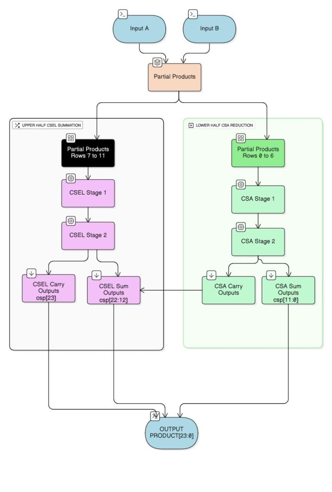
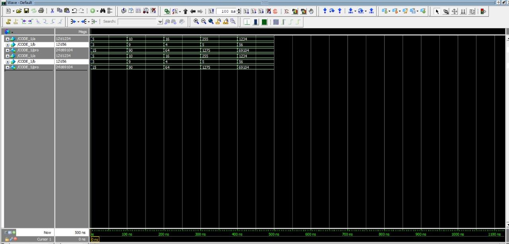
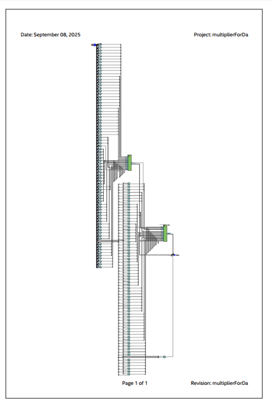

# 12x12-Hybrid-Adder

A 12×12-bit hardware multiplier for FPGA that combines a **Carry Save Adder (CSA)** tree for partial-product reduction with a **Carry Select Adder (CSLA)** for the final, delay-critical addition stage — with a **Ripple Carry Adder (RCA)** used for the least-significant chunk of the final sum.

> Course project — *BECE406E: FPGA Based System Design*, VIT Chennai
> Authors: Aniruddhan S, Mirunalini A, Vinay K · Guide: Dr. Jean Jennifer Nesam

## Why a hybrid adder?

Multiplication on FPGA breaks down into three stages: partial-product generation, partial-product reduction, and final carry propagation. A single adder type across the whole width forces a trade-off between area and delay. This design uses:

- **CSA** where partial products overlap heavily (lower/mid bits) — no long carry chains, cheap on LUTs.
- **CSLA** for the upper bits — precomputes sum/carry for both carry-in values and selects with a mux, cutting critical-path delay where carry propagation would otherwise dominate.
- **RCA** for the smallest final chunk, where a simple ripple adder is cheaper than a full CLA/CSLA with negligible delay cost.

Two versions of the multiplier were implemented and compared:

| Version | Description |
|---|---|
| **`rtl/multiplier_no_grouping.v`** | Bit-level design — every partial product combined individually via HA/CSA/CSEL stages (Code 1). |
| **`rtl/multiplier_grouped.v`** | Bits grouped into blocks, reduced with a CSA tree, then a hybrid RCA + Carry-Select final adder (Code 2). This is the optimized version. |

## Repository structure

```
12x12-Hybrid-Adder/
├── rtl/
│   ├── multiplier_no_grouping.v     # Code 1: bit-level CSA + CSLA multiplier
│   └── multiplier_grouped.v         # Code 2: grouped hybrid CSA/RCA/CSLA multiplier (final design)
├── tb/
│   └── tb_multiplier_grouped.v      # Basic self-checking testbench for the grouped design
├── docs/
│   ├── block_diagram/               # Architecture / block diagram
│   ├── screenshots/
│   │   ├── code1_no_grouping/       # Waveforms + synthesis/power reports for Code 1
│   │   └── code2_grouping/          # Waveforms + synthesis/power reports for Code 2
│   └── report/
│       └── Final_Report.docx        # Combined final report (both assignments + comparison)
└── README.md
```

## Architecture



- 12 partial-product rows (one per multiplicand bit) generated via AND gates.
- Grouped design: rows reduced via an 11-bit CSA tree (`csa_12`) down to sum/carry vectors.
- Final addition: an 11-bit Carry Select Adder handles the upper, more significant bits (`carry_select_adder_11bit`), built from cascaded 12/13/14/15-bit carry-select blocks, each internally using 3-bit ripple-carry adders and full adders.
- Result width: 24 bits.

## Results — Code 1 vs Code 2

| Parameter | CSA + CSLA Multiplier (Code 1) | Hybrid Multiplier — Grouped (Code 2) |
|---|---|---|
| Logic Utilization (ALMs) | 221 / 41,910 | 185 / 41,910 |
| Core Dynamic Power (mW) | 30.83 | 23.99 |
| Core Static Power (mW) | 544.98 | 544.98 |
| I/O Thermal Power (mW) | 20,776.69 | 20,767.56 |
| Total Thermal Power Dissipation (mW) | 21,352.50 | 21,336.53 |
| Timing Slack (min) | 0.183 ns (Slow 0°C) | 0.000 ns (Slow 0°C) |
| Clock Relationship | 14.001 ns | 12.255 ns |

**Takeaways**
- **Area:** Grouped hybrid design uses ~16% fewer ALMs (185 vs 221).
- **Power:** Lower dynamic power (23.99 mW vs 30.83 mW) and slightly lower total thermal power.
- **Timing:** Shorter clock period (12.255 ns vs 14.001 ns) → higher achievable operating frequency.

The grouped hybrid multiplier (Code 2) is the better-performing design overall — fewer resources, lower power, faster clock — at the cost of a tighter (zero) timing slack margin.

## Simulation waveforms & synthesis reports

Screenshots for both versions (simulation output, synthesis summary, power & delay reports) are under `docs/screenshots/code1_no_grouping/` and `docs/screenshots/code2_grouping/`.

| Code 1 (no grouping) | Code 2 (grouped, final design) |
|---|---|
|  |  |

## Running the simulation

```bash
iverilog -o sim rtl/multiplier_grouped.v tb/tb_multiplier_grouped.v
vvp sim
```

Or open `rtl/multiplier_grouped.v` in Quartus/ModelSim as an entity named `multi_12` (inputs `a[11:0]`, `b[11:0]`, output `pro[23:0]`).

## Conclusion

The proposed 12×12 hybrid adder–based multiplier demonstrates an efficient FPGA implementation by strategically combining CSA and CSLA architectures. Using CSA where partial products overlap minimizes carry-propagation delay, while CSLA in the upper, delay-critical region accelerates final addition. This division of labor reduces critical-path delay, optimizes LUT/ALM utilization, and balances performance with resource consumption compared to a naive single-adder implementation, with the grouped variant offering the best overall speed/area/power trade-off.

## Authors

- Aniruddhan S — 23BLC1159
- Mirunalini A — 23BLC1224
- Vinay K — 23BLC1298

*BECE406E – FPGA Based System Design, VIT Chennai · Guide: Dr. Jean Jennifer Nesam*
